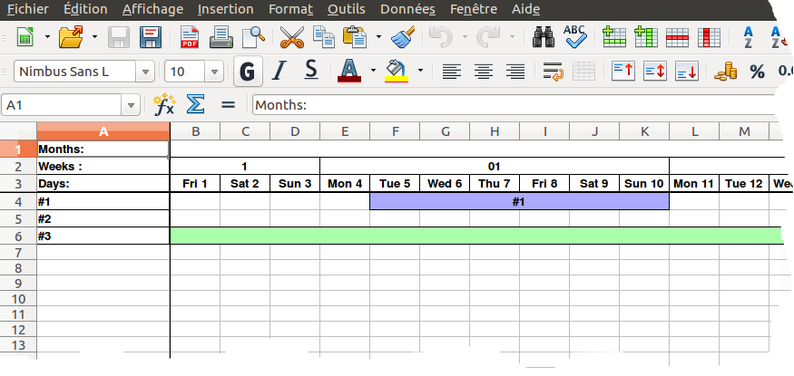

# odsPhpGenerator

odsPhpGenerator is a library written in PHP to generate Open Document Spreadsheet (.ods)




## Features

* UTF-8 Encoding
* Multi tables
* Merge Cells
* Formula
* Images
* And more


## Install

By composer :

``` bash
$ composer require lapinator/ods-php-generator
```

## Example

``` php
use odsPhpGenerator\ods;
use odsPhpGenerator\odsTable;
use odsPhpGenerator\odsTableRow;
use odsPhpGenerator\odsTableCellString;

// Load library
require_once '../vendor/autoload.php';

// Create Ods object
$ods  = new ods();

// Create table named 'table 1'
$table = new odsTable('table 1');

// Create the first row
$row   = new odsTableRow();

// Create and add 2 cell 'Hello' and 'World'
$row->addCell( new odsTableCellString("Hello") );
$row->addCell( new odsTableCellString("World") );

// Attach row to table
$table->addRow($row);

// Attach talble to ods
$ods->addTable($table);

// Download the file
$ods->downloadOdsFile("HelloWorld.ods");
```

More examples in directory examles 